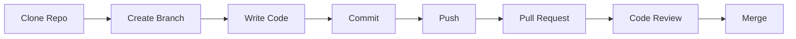
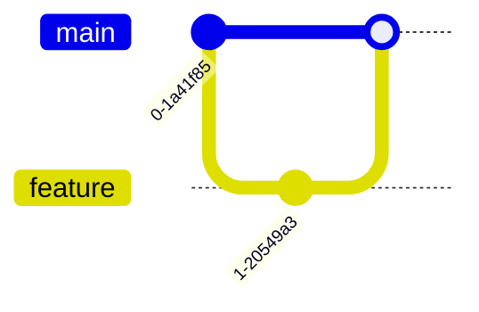

# 📘 Git & GitHub Complete Guide (Beginner → Advanced)

> 🚀 Industry-level notes designed for beginners and future developers  

---

# 📑 Table of Contents

1. What is Git & Why Companies Use It  
2. What is GitHub  
3. Installation & Setup  
4. Git Basics (Local)  
5. Working with Remote (GitHub)  
6. Branching (Core Industry Skill)  
7. Merging & Conflicts (Real Problems)  
8. Undoing Mistakes (Very Important)  
9. Stashing & Temporary Work  
10. Logs & History  
11. Collaboration Workflow (REAL COMPANY FLOW)  
12. Advanced Concepts  
13. Best Practices (Industry Tips)  
14. Common Errors + Fixes  
15. Cheat Sheet (Final Revision)  

---

## 🚀 1. What is Git?

Git is a distributed version control system used to track changes in code over time.

### 🔹 Why companies use Git:
- Multiple developers work on the same project  
- Track history of changes  
- Easily fix bugs by reverting code  
- Maintain production stability  

### 🔹 Real-world example:
In a company, if a new update breaks the login system, developers can revert to a previous working version using Git.

---

## 🌐 2. What is GitHub?

GitHub is a cloud platform that stores Git repositories.

### 🔹 Why GitHub:
- Collaboration with teams  
- Backup of code  
- Code reviews using Pull Requests  

---

## ⚙️ 3. Installation & Setup

```bash
git config --global user.name "Your Name"
git config --global user.email "your@email.com"
````

Check configuration:

```bash
git config --list
```

👉 Verifies your Git setup

---

## 📁 4. Git Basics (Local)

### 🔹 Step 1: Create a Project Folder

```bash
mkdir my-project
cd my-project
````

👉 Creates and enters your project folder

---

### 🔹 Step 2: Initialize Repository

```bash
git init
```

👉 Starts tracking your project with Git

---

### 🔹 Step 3: Check File Status

```bash
git status
```

👉 Shows current state of files

---

### 🔹 Step 4: Add Files

```bash
git add file.txt
git add .
```

👉 Adds files to staging area

---

### 🔹 Step 5: Commit Changes

```bash
git commit -m "Initial commit"
```

👉 Saves your first version

---

### 🔹 Real-world example:

You create a project → add files → commit → now Git tracks everything

````


## 🌐 5. Working with Remote (GitHub)

Before connecting Git to GitHub, you must first create a repository on GitHub.

---

### 🔹 Step 1: Create Repository on GitHub

1. Go to GitHub  
2. Click **New Repository**  
3. Enter repository name (example: `git-github-notes`)  
4. Click **Create repository**

👉 This gives you a remote project space in the cloud

---

### 🔹 Step 2: Connect Local Project to GitHub

```bash
git remote add origin <repo_url>
```
### Push code

```bash
git branch -M main
git push -u origin main
```

👉 Uploads code to GitHub

---

### Clone repository

```bash
git clone <repo_url>
```

👉 Downloads project from GitHub

---

### Pull latest changes

```bash
git pull origin main
```

👉 Always pull before starting work

---

## 🌿 6. Branching (Core Industry Skill)

```bash
git checkout -b feature-login
git checkout feature-login
```

👉 Creates and switches branch

### 🔹 Why branching:

* Work on features independently
* Prevent breaking main code

### 🔹 Real-world example:

* main → production code
* feature-login → your task

---

## 🔀 7. Merging & Conflicts (Real Problems)

### Merge branch

```bash
git checkout main
git merge feature-login
```

👉 Combines feature into main

---

### Merge conflicts

Happens when:

* Two developers edit same file

### Fix conflicts

```bash
git add .
git commit
```

👉 Resolve manually then commit

---

## 🔙 8. Undoing Mistakes (Very Important)

### Undo staged file

```bash
git reset file.txt
```

---

### Undo commit (keep code)

```bash
git reset --soft HEAD~1
```

---

### Undo everything

```bash
git reset --hard HEAD~1
```

---

## 📦 9. Stashing & Temporary Work

```bash
git stash
git stash pop
```

👉 Temporarily saves work

### 🔹 Real-world example:

You are working → urgent task comes → stash work → switch task

---

## 📜 10. Logs & History

```bash
git log
git log --oneline
```

👉 Shows commit history

---

## 🏢 11. Collaboration Workflow (REAL COMPANY FLOW)

```text
git pull origin main
git checkout -b feature-name
git add .
git commit -m "message"
git push origin feature-name
Create Pull Request → Review → Merge
```

---

## 🧭 Workflow Diagram



---

## 🌿 Branching Diagram



---

## 🚀 12. Advanced Concepts

### Rebase

```bash
git rebase main
```

👉 Keeps history clean

---

### Cherry-pick

```bash
git cherry-pick <commit_id>
```

👉 Apply specific commit

---

## 📁 13. .gitignore

```text
node_modules/
.env
dist/
```

👉 Prevents unnecessary files from being tracked

---

## 🧠 14. Best Practices (Industry Tips)

* Never push directly to main
* Always write meaningful commit messages
* Pull before push
* Use branches for features
* Keep commits small

---

## ⚡ 15. Common Errors + Fixes

### Error: push rejected

```bash
git pull origin main --rebase
```

👉 Fix by syncing latest changes

---

## 📊 16. Cheat Sheet (Final Revision)

| Command      | Purpose         |
| ------------ | --------------- |
| git init     | Initialize repo |
| git add .    | Stage files     |
| git commit   | Save changes    |
| git push     | Upload code     |
| git pull     | Get latest code |
| git branch   | Create branch   |
| git checkout | Switch branch   |
| git merge    | Merge branches  |

---

## 🏁 Final Note

This guide helps:

* Beginners understand Git from zero
* Students prepare for real-world development
* Developers follow proper workflow

---

## 👩‍💻 Author

**Bhuvaneshwari** 

```


